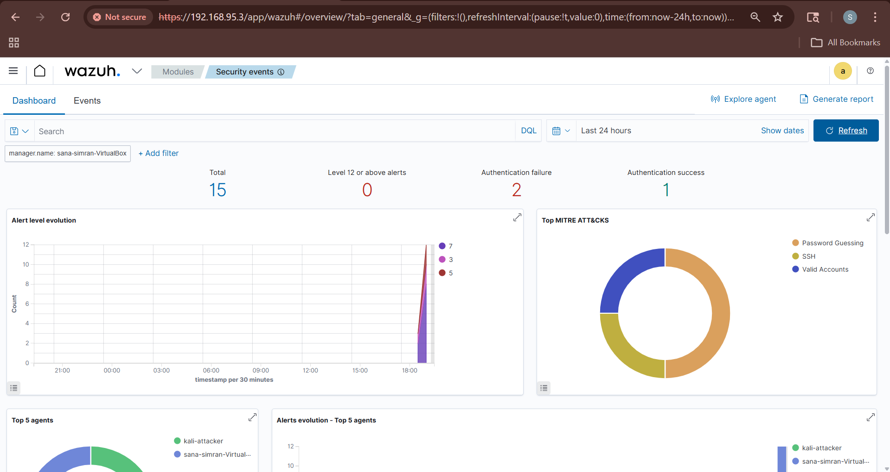
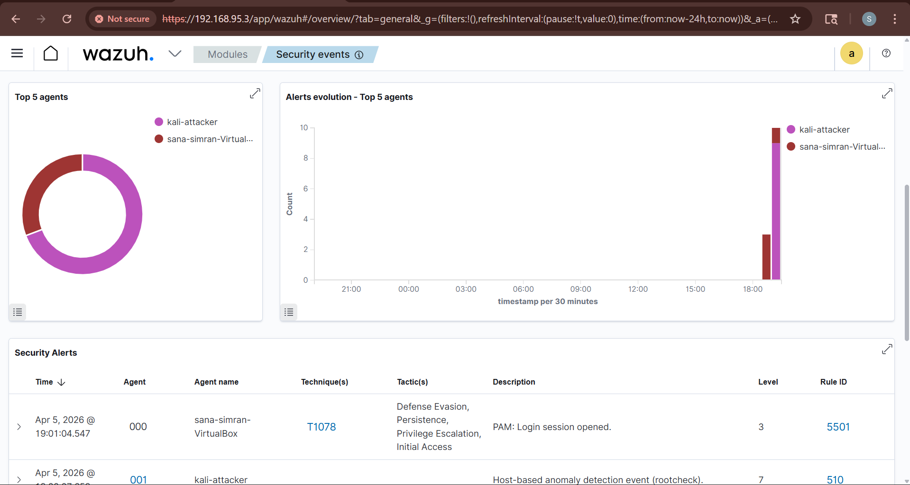
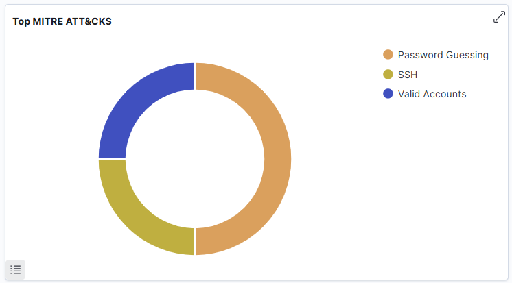
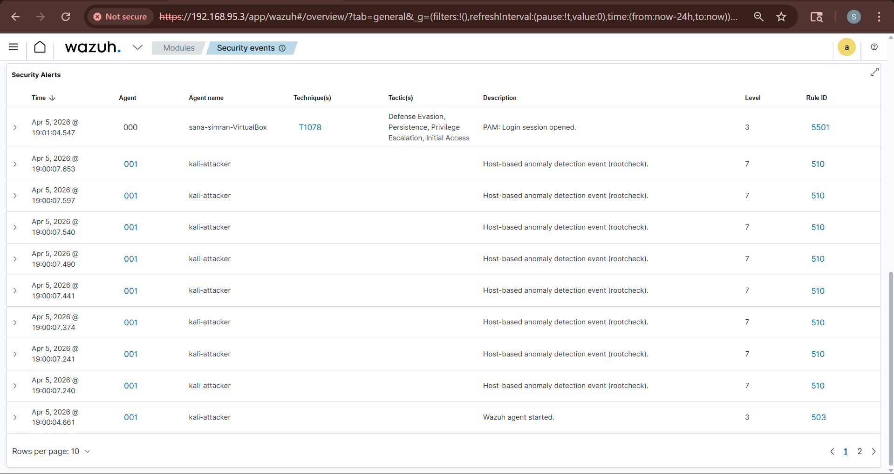
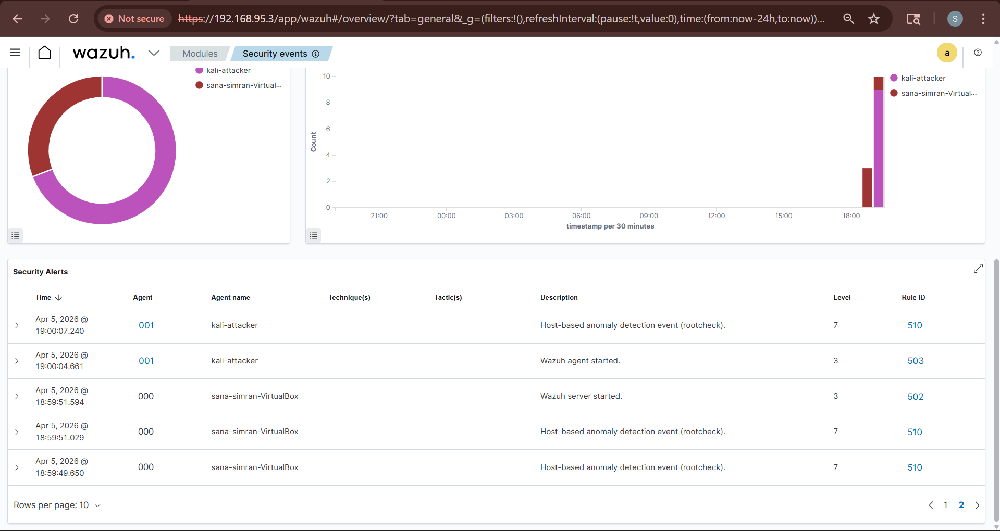
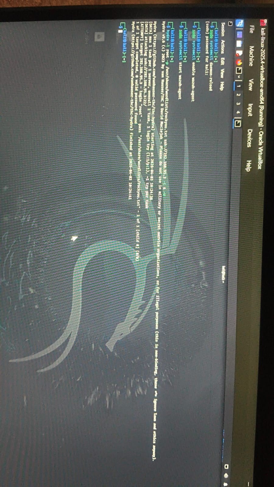

# 🛡️ Home SOC Lab — Wazuh SIEM


> A fully functional home Security Operations Center (SOC) built using Wazuh SIEM on VirtualBox. This lab simulates real-world attack scenarios and demonstrates threat detection, log analysis, and incident monitoring capabilities.

---

## 📌 Project Overview

This project involves setting up a complete SOC environment from scratch, connecting a Kali Linux attack machine as a monitored agent, and generating real security alerts using offensive tools like Hydra. All events are monitored and visualized through the Wazuh dashboard.

**Key Achievement:** Successfully detected MITRE ATT&CK technique **T1078 (Valid Accounts)** — covering Defense Evasion, Persistence, Privilege Escalation, and Initial Access tactics — in real time.

---

## 🏗️ Architecture

```
Host Machine (Windows 11)
        │
        └── Oracle VirtualBox
                │
                ├── 🖥️  Ubuntu 24.04 Server  ←  Wazuh Manager (SIEM)
                │         IP: 192.168.95.3
                │         Services: Wazuh Indexer + Manager + Dashboard
                │
                └── 💀  Kali Linux 2025.4    ←  Attack Machine (Agent)
                          Agent: kali-attacker
                          Status: Active ✅
```

---

## 🛠️ Tools & Technologies

| Tool | Purpose |
|------|---------|
| **Wazuh 4.7.5** | SIEM — Log collection, correlation, alerting |
| **Ubuntu 24.04** | Wazuh Manager host |
| **Kali Linux 2025.4** | Attack simulation machine |
| **VirtualBox** | Virtualization platform |
| **Hydra** | SSH brute-force simulation |
| **MITRE ATT&CK** | Threat intelligence framework |

---

## ⚙️ Lab Setup

### Prerequisites
- Oracle VirtualBox
- 16GB RAM (minimum 8GB)
- Ubuntu 24.04 ISO
- Kali Linux VirtualBox image

### Network Configuration
```
Adapter 1: NAT          → Internet access
Adapter 2: Host-Only    → Internal lab communication (192.168.95.0/24)
```

### Wazuh Installation
```bash
# Download installer
curl -O https://packages.wazuh.com/4.7/wazuh-install.sh

# Install all components (Manager + Indexer + Dashboard)
sudo bash wazuh-install.sh -a -i

# Access dashboard
https://192.168.95.3
```

### Kali Agent Deployment
```bash
# Install Wazuh agent on Kali
WAZUH_MANAGER="192.168.95.3" WAZUH_AGENT_NAME="kali-attacker" \
sudo apt install wazuh-agent -y

# Start agent
sudo systemctl daemon-reload
sudo systemctl enable wazuh-agent
sudo systemctl start wazuh-agent
```

---

## 🚨 Attack Simulation & Detection

### SSH Brute Force — Hydra
```bash
hydra -l root -P /usr/share/wordlists/rockyou.txt \ssh://192.168.95.3 -t 4 -V
```

### Alerts Generated

| Alert | Description | Level | MITRE Technique |
|-------|-------------|-------|-----------------|
| Authentication failures | Multiple failed SSH logins | 5 | T1110 |
| PAM Login session opened | Successful auth event | 3 | T1078 |
| Host-based anomaly | Rootcheck detection | 7 | T1078 |
| Wazuh agent started | Agent connectivity | 3 | — |

### MITRE ATT&CK Coverage
- **T1078** — Valid Accounts
  - ✅ Defense Evasion
  - ✅ Persistence
  - ✅ Privilege Escalation
  - ✅ Initial Access

---

## 📊 Dashboard Screenshots

### Security Events Overview


### Agents Connected


### MITRE ATT&CK Detection


### Security Alerts



### Hydra Attack Simulation


---

## 📁 Repository Structure

```
home-soc-lab/
├── README.md                  ← Project documentation
├── screenshots/
│   ├── dashboard-overview.png
│   ├── agents-connected.png
│   ├── security-alerts.png
│   ├── mitre-attack.png
│   └── hydra-attack.png
├── docs/
│   ├── setup-guide.md
│   └── detection-rules.md
└── configs/
    └── wazuh-agent.conf
```

---

## 🎯 Key Learnings

- Deploying and configuring enterprise-grade SIEM from scratch
- Understanding Wazuh architecture — Indexer, Manager, Dashboard
- Mapping real attacks to MITRE ATT&CK framework
- Log correlation and alert triage in a SOC environment
- Network segmentation using Host-Only adapters in VirtualBox
- Offensive tool usage (Hydra) for controlled attack simulation

---

## 🔮 Future Improvements

- [ ] Add Windows VM as additional monitored endpoint
- [ ] Configure custom detection rules for specific attack patterns
- [ ] Integrate threat intelligence feeds
- [ ] Set up email/Slack alerting pipeline
- [ ] Deploy Suricata IDS for network-level detection
- [ ] Simulate additional MITRE ATT&CK techniques

---

## 👤 Author

**Sana Simran**
- 🌐 Portfolio: [sanasimran.github.io](https://sanasimran1403-jpg.github.io)
- 💼 LinkedIn: www.linkedin.com/in/sana-simran-7969a8326
- 🐙 GitHub: [@sanasimran1403-jpg](https://github.com/sanasimran1403-jpg)
- ⬡ HackTheBox: [[HTB Profile](https://app.hackthebox.com)](https://profile.hackthebox.com/profile/019d5e1a-9608-73df-a198-396972b94901)

---

> ⚠️ **Disclaimer:** This lab is built for educational purposes only. All attack simulations are performed in an isolated virtual environment. Never use these techniques on systems you do not own or have explicit permission to test.
